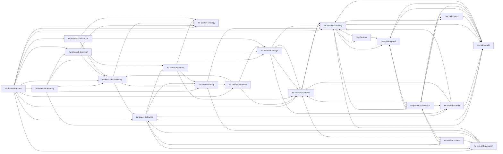

# RW Research Skill 关系图

```mermaid
flowchart LR
  router["rw-research-router"]
  learning["rw-research-learning"]
  question["rw-research-question"]
  discovery["rw-literature-discovery"]
  search["rw-search-strategy"]
  extractor["rw-paper-extractor"]
  evidence["rw-evidence-map"]
  novelty["rw-research-novelty"]
  review["rw-review-methods"]
  design["rw-research-design"]
  data["rw-research-data"]
  stats["rw-statistics-audit"]
  referee["rw-research-referee"]
  passport["rw-research-passport"]
  citation["rw-citation-audit"]
  audit["rw-claim-audit"]
  patch["rw-revision-patch"]
  write["rw-academic-writing"]
  tone["rw-phd-tone"]
  submission["rw-journal-submission"]
  tools["rw-research-lab-router"]

  router --> learning
  learning --> question
  learning --> discovery
  learning --> evidence
  learning --> design
  learning --> audit
  router --> question
  router --> discovery
  router --> search
  router --> novelty
  router --> passport
  router --> tools
  router --> extractor
  router --> referee
  router --> write
  question --> discovery
  question --> search
  question --> design
  discovery --> search
  discovery --> extractor
  discovery --> evidence
  extractor --> evidence
  extractor --> audit
  extractor --> passport
  extractor --> review
  extractor --> data
  extractor --> stats
  evidence --> novelty
  evidence --> write
  novelty --> discovery
  novelty --> design
  novelty --> referee
  review --> evidence
  review --> search
  review --> referee
  design --> referee
  design --> stats
  design --> write
  data --> passport
  data --> submission
  data --> referee
  stats --> referee
  stats --> audit
  stats --> write
  referee --> design
  referee --> write
  write --> tone
  write --> citation
  write --> audit
  write --> patch
  write --> referee
  write --> submission
  tone --> write
  tone --> patch
  audit --> patch
  citation --> audit
  citation --> submission
  audit --> write
  patch --> audit
  patch --> submission
  passport --> extractor
  passport --> evidence
  passport --> write
  submission --> patch
  submission --> citation
  submission --> audit
  submission --> data
  submission --> stats
  submission --> referee
  tools --> discovery
  tools --> search
  tools --> review
  tools --> design
```

图中的 Router 边表示默认入口或入口内部接续。用户明确调用内部 Skill 时，仍保留旧名称兼容；默认路由不跨越其他公开入口的归属边界。
